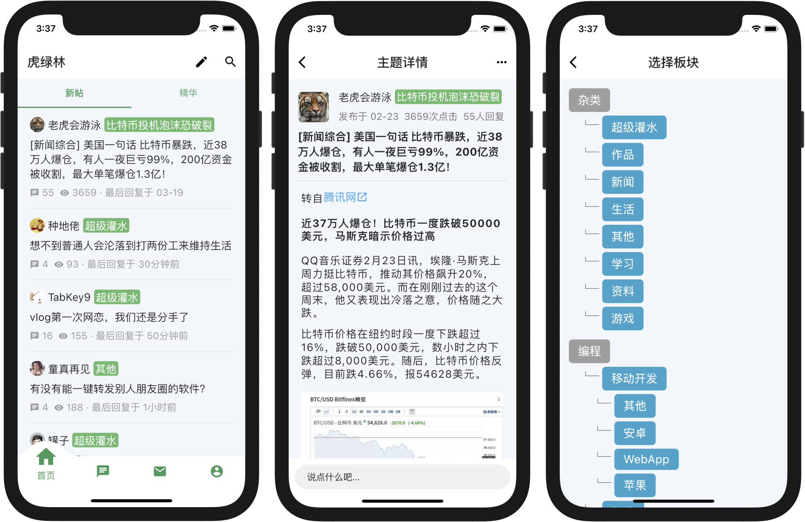
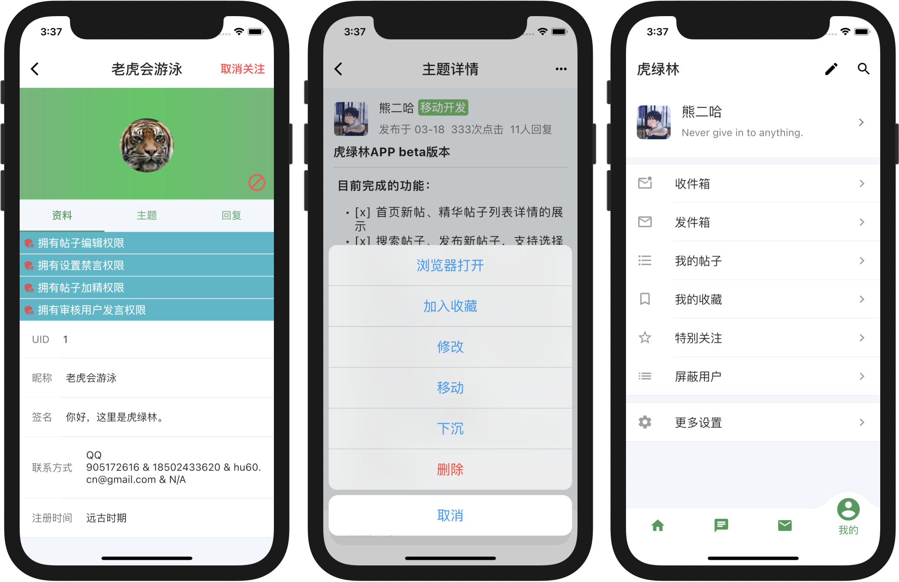

# 虎绿林 for APP

使用 Flutter 开发的一款虎绿林 APP, 仅供学习交流.

## TODO

* [x] 首页新帖、精华帖子列表详情的展示
* [x] 搜索帖子、发布新帖子，支持选择板块
* [x] 内信、艾特消息的列表(包括已读未读)展示
* [x] 查看用户个人信息页面(包括主题列表、回复列表)
* [x] 用户关注、屏蔽用户以及列表展示(包括取消操作)
* [x] 我的帖子、收藏帖子列表展示(包括取消收藏操作)
* [x] 楼层正序、倒序
* [x] 帖子和评论的增删改
* [x] 评论支持表情输入
* [x] 修改个人资料(头像、用户名、签名等)
* [x] 聊天室

## 截图




## 如何编译

**先决条件：**  
1.你必须已经安装好 Flutter，安装方法[直达车](https://flutter.cn/docs/get-started/install)  
2.然后创建证书，创建方法[直达车](https://flutter.cn/docs/deployment/android#create-a-keystore)

克隆项目后进入 android 目录，创建文件 ```key.properties```，内容如下：

```
storePassword=证书储存密码
keyPassword=证书密码
keyAlias=key
storeFile=证书路径，例如：/Users/wispx/Develop/flutter-key.jks
```

接下来进入项目根目录执行命令：```flutter build apk``` 进行打包。  
IOS 打包 **必须** 要有 Xcode，打包命令```flutter build ios```

## 其他说明

- APP 中不支持展示小尾巴，如果想要展示请不要使用 span 标签
- APP 中不支持展示 HTML 内联样式，所有存在内联样式的标签将会被剔除不显示
- APP 图标出自 https://www.flaticon.com/free-icon/tiger_3277708

## License

- MIT
