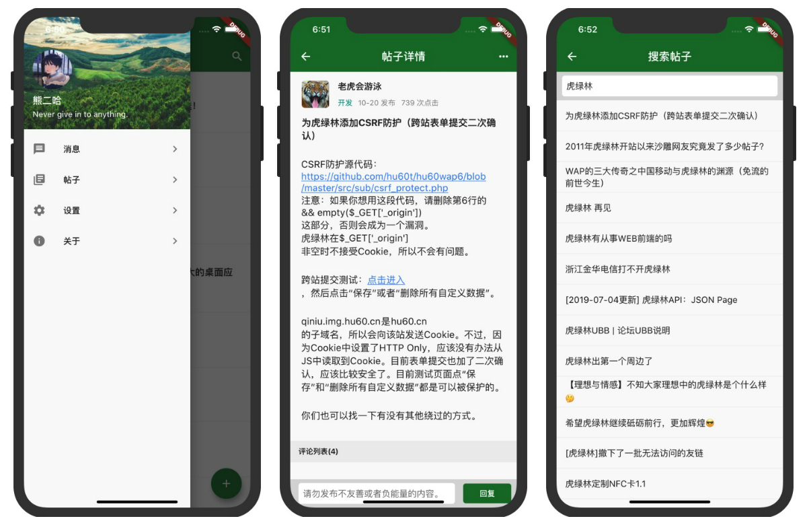

# hu60

使用 Flutter 开发的一款虎绿林 APP, 仅供学习交流.

## 如何构建?
- IOS请参考官方文档
- Android
    - 根据官方文档创建 app 签名
    - 创建一个名为<app dir>/android/key.properties的文件，内容：
    ```
        storePassword=你的 keystore 密码
        keyPassword=你的 keystore 密码
        keyAlias=key
        storeFile=签名文件所在位置, 例如: /Users/wispx/key.jks
    ```
    然后即可构建发行版 API

## 预览


## 使用的开源库
- dio
- provider
- flutter_screenutil
- json_serializable
- build_runner
- flutter_spinkit
- cached_network_image
- common_utils
- shared_preferences
- flutter_html
- url_launcher
- pull_to_refresh
- toast
- flutter_launcher_icons

## License
- MIT
